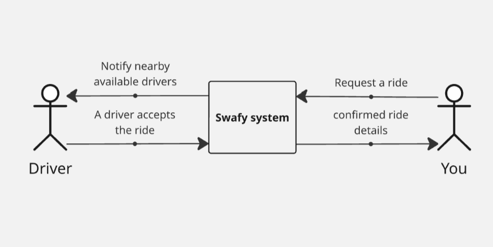

# Swafy Ride-Sharing System

##### High level view:

##### Notes:

- The role will be determined according to the currently used app (For now).
- Token will be generated after login or register and stay valid until the user logs out.
- The ride types that will be shown to the user will depend on the available number of drivers of that type of ride.
- If the user chose the delivery option, they will be able to place a delivery request.
  - A delivery request will contain a product specification, pick-up and drop-off locations, and other info.
- The pricing will differ based on the ride type (Shared / non-shared).
-